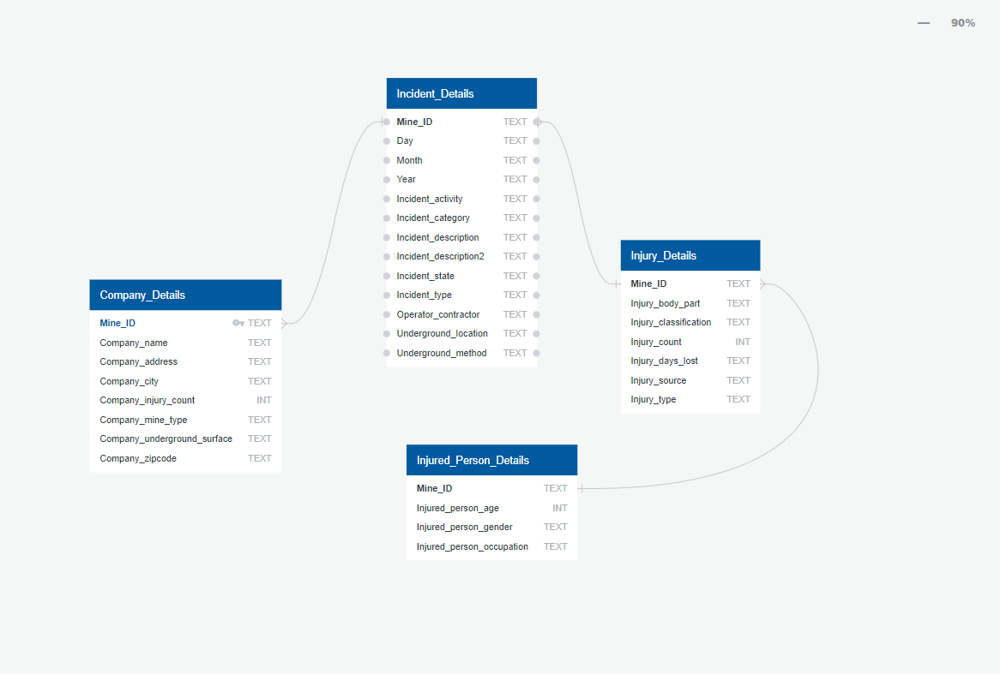

# ETL-Project Scoping Document

## Project Leads and Key Contacts:
- Nicholas Mcmahon – Data Analyst
- Grant Towers – Data Analyst
- Amy Anderson and Daniel Kasatchkow – Safety Experts (Subject Matter Experts)

## Project Background:

Safety Team have requested we prepare a new database for the storage and query (as required), of regulator (external) injury data from 2020. 
This will allow the team to complete analysis of our company injuries with industry, which will be used provide insights to the leadership team on areas for improvement.

## Data Project Requirements:

We are required to build a new DB and ETL process so that the data is structured, cleansed and added to the DB. 
As the Safety Team are not data experts, we have seconded Amy and Daniel, who will work with us to cleanse the data by identiftying unrequired columns and rename existing labels (to better suit the end users). 

## Data Transformation Requirements:

As part of our preparation and review, we have had to review not only the industry data, but also our own internal data to ensure that is comparable and will allow us to collate the information. 
Amazingly, our review identified that the columns used by the regulator were exactly the same as our data! There were some exceptions to this, as the regulator captured a lot more additional information than we capture.
Subsequent to this review, we have developed the file containing all required changes “Data Mapping - Raw Data to Table and Columns”. This file is stored in the project repository. 

This file contains:

- Source Data column headers;
- Updated column names (to be updated);
- SQL tables to be created and data written to; and
- Data Transformation updates (to clean ‘dirty’ data as required). 
Note: The data cleansing activity will need to be reviewed each year, just to ensure that all information is still in the same format. 

## Project Deadline:
Project to be completed and handed over to the client on 13/06/2022.

# Project Report
-----------------------------------------------------------------------------------------------------------------------------------------------------------------------

## Data Sourcing and Extraction

To fill the request of the safety team we needed a reasonably large set of comprehensive data. Lucky for us it was readily available at https://www.cdc.gov/niosh/mining/data/
From here we were able to download two large csv files from the 2020 sets of data, these CVSs where:

-	employment.csv
-	incident_file.csv

To understand properly how we needed to transform the data we had in the CSV files we first decided on a table structure for our Database. 
Firstly, we used an excel spreadsheet to dissect the tables in the CSV files to decide what columns were most useful for our task (see first picture below). Once we had a list of useful columns used the tool  http://www.quickdatabasediagrams.com to come up with the schema (second picture) and export it to a SQL file.

 

## Transformation of Data

Once we were happy with the table structure and data we had acquired it was time use pandas to import it into our notebook file and let the transformation process begin. The transformation steps were as follows:
-	Import all dependencies and setup CSV panda reads.
-	Create clean incident data table by dropping additional columns and rename remaining columns from data frames.
-	Replace identified 'dirty' data values in the incident_data table.
-	Create clean employment data table by dropping additional columns and rename remaining columns from data frames.

## Loading Data

Once the data was transformed to the desired format and cleaned it was time to export it and load it to the final database. We decided to use a relational database (PostgreSQL).  The data load steps were as follows:
-	Create Incident_data Database in Postgres pgAdmin4
-	Create 'incident_details' table and export to csv file.
-	Create 'injured_person_details' table and export to csv file.
-	Create 'injury_details' table and export to csv file.
-	Create 'company_details' table and export to csv file.
-	Create a database connection to postgres. 
-	Create New Tables and upload data.

